# AyuScan — Low-Cost Wearable Vital Monitoring System

## Overview

AyuScan is a low-cost, wearable, IoT-based vital monitoring system designed to continuously measure key physiological parameters in real time. The system integrates biomedical sensors with an ESP32 microcontroller to acquire, process, and transmit health data wirelessly to a cloud dashboard for remote monitoring and early detection of abnormal conditions.

The device measures heart rate using both ECG and photoplethysmography (PPG), blood oxygen saturation (SpO₂), body temperature, and estimates cardiac output. Data is processed locally using filtering and peak detection algorithms to ensure accuracy and reliability.

All components are housed in a custom 3D-printed TPU enclosure, providing flexibility, durability, and comfort for wearable use.

## 🚀 Key Features

- **Real-time ECG-based heart rate monitoring** using an integrated ECG Heart Rate Sensor.
- **PPG-based heart rate and SpO₂ measurement** using a Pulse Oximetry and Heart-Rate Sensor.
- **Non-contact body temperature measurement** using an infrared digital Temperature Sensor.
- **Estimated cardiac output calculation** and wireless cloud monitoring using ESP32 and Blynk IoT.
- **Automatic abnormal condition detection** with live data visualization on mobile and web dashboards.
- **Compact, wearable design** using a custom 3D-printed TPU enclosure.

## 🛠 Hardware Components

| Component | Description |
| :--- | :--- |
| **ESP32** | 38-pin DevKit (Dual-core, Wi-Fi/Bluetooth enabled) |
| **ECG Heart Rate Sensor** | Analog front-end for ECG/EMG/EOG/EEG |
| **PPG & SpO₂ Sensor** | Pulse Oximetry and Heart-Rate measurement |
| **IR Temperature Sensor** | Contactless Infrared (IR) Digital Temperature measurement |

## 🔌 Pin Configuration

### I2C Bus (Vitals & Temperature Sensors)
*Multiple sensors share the same I2C pins.*

| Function | ESP32 Pin |
| :--- | :--- |
| **SDA (Data)** | GPIO 21 |
| **SCL (Clock)** | GPIO 22 |

### ECG Heart Rate Sensor
| Function | ESP32 Pin |
| :--- | :--- |
| **Signal Output** | GPIO 34 (ADC) |
| **Power (VCC)** | 3.3V / 5V |
| **Ground (GND)** | GND |

## 🏗 System Architecture

```mermaid
graph TD
    A["ECG Heart Rate Sensor"] --> E["ESP32"]
    B["PPG & SpO₂ Sensor"] --> E
    C["IR Temperature Sensor"] --> E
    E --> F["Signal Processing"]
    F --> G["WiFi Transmission"]
    G --> H["Blynk Cloud Dashboard"]
    H --> I["Mobile and Web Monitoring"]
```

## 📊 Measured Parameters

- **ECG Heart Rate** (BPM)
- **PPG Heart Rate** (BPM)
- **Blood Oxygen Saturation** (SpO₂ %)
- **Body Temperature** (°C)
- **Cardiac Output** (L/min, estimated)
- **ECG Signal waveform** (raw)

## 📦 Software Dependencies

Ensure you have the following libraries installed in your Arduino IDE:

1. **Pulse and Proximity Sensor Library** (SparkFun MAX3010x)
2. **Digital Temperature Sensor Library** (Adafruit MLX90614)
3. **Blynk Library** (for cloud integration)

## 📂 Project Structure

- `BioAmpEXGPill.ino`: Heart rate monitoring via ECG.
- `MAX30105SpO2.ino`: Integrated HR and SpO2 monitoring.
- `TempMLX90614.ino`: Body temperature sensing.
- `MAX_calibiration.cpp`: Utility for calibrating sensor brightness and thresholds.

## 📄 Usage Instructions

1. **Setup Hardware:** Connect sensors according to the [Pin Configuration](#-pin-configuration).
2. **Calibration:** Use the calibration utility to find optimal LED power for the optical sensors.
3. **Firmware Upload:** Upload the desired `.ino` file to the ESP32.
4. **Monitoring:** View live data on the **Serial Monitor (115200 baud)** or via the **Blynk mobile/web app**.

## 💡 Applications & Innovation

- **Remote Patient Monitoring & Telemedicine**: Scalable architecture for health tracking.
- **Fitness & Research**: Accurate real-time data for workout tracking and biomedical prototyping.
- **Innovation**: A single low-cost wearable platform combining multiple bio-sensing modalities with advanced cloud integration.

---
*Created as part of Project Morpheus 2026.*